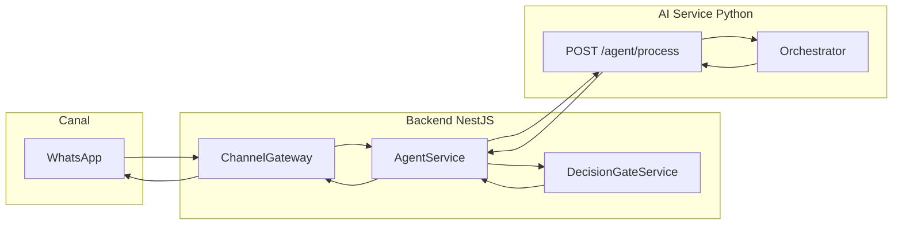

# Estrutura e Infraestrutura de IA do OncoNav

## Visão geral

A IA no OncoNav está centralizada no **AI Service** (FastAPI, Python, porta 8001). O **backend NestJS** orquestra as chamadas: monta contexto clínico, chama o AI Service e aplica o decision gate (ações auto-aprovadas vs. aprovação humana). O fluxo end-to-end é:

---

## 1. Entrada e orquestração (Backend → AI Service)

- **Backend** ([backend/src/agent/agent.service.ts](backend/src/agent/agent.service.ts)):
  - `processIncomingMessage`: obtém conversa, monta contexto clínico (`buildClinicalContext`), protocolo ativo, histórico recente e `agentConfig` do tenant.
  - Chama o AI Service em `POST ${AI_SERVICE_URL}/api/v1/agent/process` com: `message`, `patient_id`, `tenant_id`, `clinical_context`, `protocol`, `conversation_history`, `agent_state`, `agent_config`.
  - Timeout 30s; em falha, envia mensagem de fallback ao paciente.
- **agent_config** enviado pelo backend contém apenas: `llm_provider`, `llm_model`, `llm_fallback`, `agent_language`, `max_auto_replies`. As **chaves de API** (OpenAI/Anthropic) não são enviadas; o AI Service usa variáveis de ambiente (`.env` do projeto ou do `ai-service`).

---

## 2. Pipeline do agente (Orchestrator)

O ponto de entrada no AI Service é [ai-service/src/agent/orchestrator.py](ai-service/src/agent/orchestrator.py) → `AgentOrchestrator.process(request)`.

**Ordem do pipeline:**

| #   | Etapa                     | Descrição                                                                                                                                                                                                                                                                          |
| --- | ------------------------- | ---------------------------------------------------------------------------------------------------------------------------------------------------------------------------------------------------------------------------------------------------------------------------------- |
| 1   | Questionário ativo        | Se `agent_state.active_questionnaire` existe, trata a mensagem como resposta de questionário (`_process_questionnaire_answer`) e retorna sem o resto do pipeline.                                                                                                                  |
| 2   | Classificação de intenção | [intent_classifier](ai-service/src/agent/intent_classifier.py): regex + fallback LLM. Intents: EMERGENCY, GREETING, APPOINTMENT_QUERY, EMOTIONAL_SUPPORT, SYMPTOM_REPORT, QUESTION, etc.                                                                                           |
| 3   | Fast paths                | **EMERGENCY** (com `escalate_immediately`): análise de sintomas + resposta de emergência + alerta CRITICAL. **GREETING** / **APPOINTMENT_QUERY** (com `skip_full_pipeline`): resposta pré-definida sem LLM completo.                                                               |
| 4   | Análise de sintomas       | [symptom_analyzer](ai-service/src/agent/symptom_analyzer.py): keywords + LLM opcional (se `use_llm_symptom_analysis` e chaves configuradas). Saída: `detectedSymptoms`, `overallSeverity`, `requiresEscalation`.                                                                   |
| 5   | Regras de protocolo       | [protocol_engine](ai-service/src/agent/protocol_engine.py): avalia check-ins, gatilhos de questionário e sintomas críticos por tipo de câncer e estágio da jornada.                                                                                                                |
| 6   | Contexto clínico + RAG    | [context_builder](ai-service/src/agent/context_builder.py): `build_with_rag()` monta o texto de contexto (paciente, diagnósticos, tratamentos, etapas de navegação, alertas, protocolo, análise de sintomas) e **enriquece com RAG** (trechos da base de conhecimento oncológica). |
| 7   | System prompt             | [system_prompt](ai-service/src/agent/prompts/system_prompt.py): monta o prompt do sistema com contexto RAG e trecho de protocolo; idioma via `agent_config.agent_language`.                                                                                                        |
| 8   | Geração de resposta       | **Se há chaves LLM** (Anthropic/OpenAI): pipeline **multi-agente** (orquestrador Opus com tools que chamam subagentes). **Se não**: uma única chamada `llm_provider.generate()` com system + histórico + mensagem.                                                                 |
| 9   | Ações e decisões          | Combina ações baseadas em regras (`_compile_actions`: sintomas, protocolo, questionário) com ações vindas das tool calls do LLM (`_parse_tool_calls_to_actions`). Deduplica em `_merge_actions`.                                                                                   |
| 10  | Estado                    | `_update_state`: atualiza `message_count`, `last_symptoms`, `last_symptom_severity`, `tracked_scales`, e opcionalmente `active_questionnaire`.                                                                                                                                     |

Retorno do `process`: `response`, `actions`, `symptom_analysis`, `new_state`, `decisions`, `intent`.

---

## 3. Multi-agente (quando há LLM)

- **Orquestrador** usa `llm_provider.run_agentic_loop()` com prompt em [orchestrator_prompt.py](ai-service/src/agent/prompts/orchestrator_prompt.py) e **tools de roteamento**: `consultar_agente_sintomas`, `consultar_agente_navegacao`, `consultar_agente_questionario`, `consultar_agente_suporte_emocional`.
- Cada “tool” é executada pelo **subagente** correspondente ([ai-service/src/agent/subagents/](ai-service/src/agent/subagents/)):
  - **SymptomAgent**, **NavigationAgent**, **QuestionnaireAgent**, **EmotionalSupportAgent**, todos estendem [base_subagent.py](ai-service/src/agent/subagents/base_subagent.py).
- **BaseSubAgent**: recebe contexto clínico (RAG) + histórico; usa `run_agentic_loop` **sem** `tool_executor` (tool calls só são **coletadas**). As tools dos subagentes são as de domínio (ex.: `registrar_sintoma`, `criar_alerta`, `iniciar_questionario`, `escalar_para_enfermagem`).
- O orquestrador chama cada subagente via `routing_tool_executor`; os `tool_calls` retornados são agregados e depois convertidos em **actions/decisions** pelo orchestrator (`_parse_tool_calls_to_actions`).
- Modelos: orquestrador `orchestrator_model` (ex.: claude-opus-4-6), subagentes `subagent_model` (ex.: claude-sonnet-4-6). Config por tenant via `agent_config`.

---

## 4. RAG (base de conhecimento)

- **Módulo**: [ai-service/src/agent/rag/knowledge_base.py](ai-service/src/agent/rag/knowledge_base.py) → classe `OncologyKnowledgeRAG`.
- **Corpus**: JSON em `ai-service/src/agent/rag/oncology_corpus.json`.
- **Embeddings**: sentence-transformers (`RAG_EMBEDDING_MODEL`, default `paraphrase-multilingual-MiniLM-L12-v2`).
- **Índice**: FAISS; cache em disco (em Windows com path não-ASCII usa `%LOCALAPPDATA%/OncoNav/rag_index_cache`).
- **Inicialização**: no **lifespan** do FastAPI ([main.py](ai-service/main.py)) chama `knowledge_rag.initialize()`; se corpus vazio ou falha, RAG fica desabilitado (retrieval retorna lista vazia).
- **Uso**: em `context_builder.build_with_rag()` a query é a mensagem do paciente (ou a última mensagem do assistente se a mensagem for genérica, ex.: “sim”, “ok”). Top-k e score threshold via env (`RAG_TOP_K`, `RAG_SCORE_THRESHOLD`). Os trechos recuperados são concatenados ao contexto clínico formatado.

---

## 5. Provedor LLM

- **Arquivo**: [ai-service/src/agent/llm_provider.py](ai-service/src/agent/llm_provider.py).
- **Provedores**: Anthropic (Claude) e OpenAI; resolução de API key: valor explícito em `config` → leitura de `.env` (ai-service, depois raiz) → `os.getenv`.
- **Métodos**: `generate(system_prompt, messages, config)` para resposta simples; `run_agentic_loop(system_prompt, initial_messages, tools, config, tool_executor, max_iterations)` para fluxo com tools (orquestrador e subagentes).
- **Fallback**: se o provedor principal falha, tenta o fallback (ex.: Anthropic → OpenAI) conforme `agent_config`. Resposta de fallback genérica se tudo falhar.

---

## 6. Priorização (modelo de ML)

- **Modelo**: [ai-service/src/models/priority_model.py](ai-service/src/models/priority_model.py) — ensemble (RandomForest + XGBoost + LightGBM) com `VotingRegressor`; score 0–100, categorias (critico/alto/medio/baixo).
- **Features**: `cancer_type`, `stage`, `performance_status`, `age`, `pain_score`, `nausea_score`, `fatigue_score`, `days_since_last_visit`, `treatment_cycle` (mapeamentos em [routes.py](ai-service/src/api/routes.py)).
- **Startup**: em [main.py](ai-service/main.py) chama `load_or_train()` de [train_priority.py](ai-service/src/models/train_priority.py); carrega joblib ou treina; `priority_model.is_trained` indica se o modelo está pronto.
- **Endpoint**: `POST /api/v1/prioritize` (ou equivalente em routes). Se o modelo não estiver treinado, usa **fallback rule-based** (pain_score ≥8, stage IV, etc.) para manter comportamento definido.
- **Backend**: usa o score/categoria para atualizar paciente e histórico em `PriorityScore` (com `modelVersion` quando aplicável).

---

## 7. Decision gate e execução (Backend)

- **Arquivo**: [backend/src/agent/decision-gate.service.ts](backend/src/agent/decision-gate.service.ts).
- **Ações auto-aprovadas** (executadas imediatamente): ex. `RESPOND_TO_QUESTION`, `RECORD_SYMPTOM`, `CREATE_LOW_ALERT`, `CREATE_HIGH_CRITICAL_ALERT`, `START_QUESTIONNAIRE`, `QUESTIONNAIRE_COMPLETE`, `SCHEDULE_CHECK_IN`, `RECALCULATE_PRIORITY`, `UPDATE_NAVIGATION_STEP`, `GREETING_RESPONSE`.
- **Ações que exigem aprovação**: ex. `CHANGE_TREATMENT_STATUS`, `RECOMMEND_APPOINTMENT`, `HANDOFF_TO_SPECIALIST`, `QUESTIONNAIRE_ESCALATION`.
- O backend percorre as `decisions` retornadas pelo AI Service, separa em `autoApproved` e `needsApproval`, executa as auto-aprovadas (ex.: criar alerta, registrar sintoma, atualizar prioridade) e persiste `new_state` na conversa. Resposta ao paciente é enviada pelo ChannelGateway.

---

## 8. Resumo dos componentes principais

| Componente     | Localização                                                                                                                                              | Função                                                |
| -------------- | -------------------------------------------------------------------------------------------------------------------------------------------------------- | ----------------------------------------------------- |
| Entrada HTTP   | [ai-service/src/api/routes.py](ai-service/src/api/routes.py)                                                                                             | `POST /api/v1/agent/process` → `orchestrator.process` |
| Orquestrador   | [ai-service/src/agent/orchestrator.py](ai-service/src/agent/orchestrator.py)                                                                             | Pipeline completo e multi-agente                      |
| Intent         | [ai-service/src/agent/intent_classifier.py](ai-service/src/agent/intent_classifier.py)                                                                   | Classificação de intenção (regex + LLM)               |
| Sintomas       | [ai-service/src/agent/symptom_analyzer.py](ai-service/src/agent/symptom_analyzer.py)                                                                     | Detecção e severidade                                 |
| Protocolo      | [ai-service/src/agent/protocol_engine.py](ai-service/src/agent/protocol_engine.py)                                                                       | Regras por câncer/estágio                             |
| Contexto + RAG | [ai-service/src/agent/context_builder.py](ai-service/src/agent/context_builder.py) + [rag/knowledge_base.py](ai-service/src/agent/rag/knowledge_base.py) | Contexto clínico e recuperação de conhecimento        |
| LLM            | [ai-service/src/agent/llm_provider.py](ai-service/src/agent/llm_provider.py)                                                                             | Anthropic/OpenAI, generate e agentic loop             |
| Subagentes     | [ai-service/src/agent/subagents/](ai-service/src/agent/subagents/)                                                                                       | Sintomas, navegação, questionário, suporte emocional  |
| Priorização    | [ai-service/src/models/priority_model.py](ai-service/src/models/priority_model.py) + routes                                                              | Ensemble ML + fallback rule-based                     |
| Backend agente | [backend/src/agent/agent.service.ts](backend/src/agent/agent.service.ts)                                                                                 | Contexto, chamada AI, normalização, estado            |
| Decision gate  | [backend/src/agent/decision-gate.service.ts](backend/src/agent/decision-gate.service.ts)                                                                 | Separação e execução de ações                         |

A estrutura está modular (orquestrador, intent, sintomas, protocolo, RAG, LLM, subagentes, priorização) e a infraestrutura depende de variáveis de ambiente para chaves de API e opções de RAG/prioridade, com fallbacks definidos quando o modelo ou o RAG não estão disponíveis.
